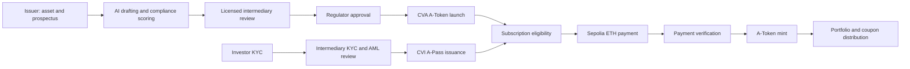

# NexusRWA

NexusRWA is an AI-assisted institutional Real-World Asset (RWA) issuance and settlement platform built around **Cleanverse CVI/CVA** and **Ethereum**. It connects prospectus drafting, compliance review, KYC, investor eligibility, A-Token issuance, subscription payment verification, minting, coupon distribution, and portfolio reporting in one auditable workflow.

Cleanverse **CVI A-Pass** defines who is eligible to invest. Cleanverse **CVA A-Token** rules define what each eligible wallet may hold. NexusRWA verifies both when a subscription is created and again when payment is confirmed, so expired, frozen, or rule-incompatible identities fail closed before minting.

## Why NexusRWA

Institutional RWA issuance is still fragmented across document preparation, regulatory review, KYC/AML, token administration, payments, and investor reporting. A one-time KYC decision also becomes stale when an identity expires, is frozen, or no longer satisfies an asset's rules.

NexusRWA turns compliance from a report into an execution gate:

- AI assists with prospectus drafting and SFC-oriented rule analysis.
- Licensed intermediaries perform compliance, technical, and KYC/AML review.
- Regulators approve an issuance or request changes.
- Cleanverse CVI issues and verifies investor A-Passes.
- Cleanverse CVA launches rule-bound A-Tokens.
- Eligibility is checked before payment and checked again at confirmation.
- Ethereum transactions prove payment, minting, and coupon distribution.

## Highlights

| Area | Implementation |
|---|---|
| **CVI integration** | Encrypted A-Pass generation, query, overwrite confirmation, status/expiry checks, tier/sub-tier checks, and jurisdiction checks. |
| **CVA integration** | A-Token launch and status synchronization with asset-specific rule packs and subscription gating on `ISSUED` status. |
| **Fail-closed eligibility** | Missing, pending, frozen, expired, rejected, or provider-error states block subscription. |
| **Payment integrity** | Sepolia ETH payment verification checks exact sender, treasury recipient, amount, receipt status, and confirmations. |
| **Mint integrity** | Mint verification requires the configured administrator and the expected ERC-20 `Transfer` event from the zero address. |
| **Coupon integrity** | Coupon reservations prevent duplicate payouts and verify the exact native ETH transfer before confirmation. |
| **AI + human control** | AI accelerates drafting and review; intermediary and regulator decisions remain explicit. |
| **Build quality** | Next.js 16, TypeScript, Viem/Wagmi, encrypted server APIs, wallet signatures, CI, and 22 Cleanverse integration tests. |

## Architecture



## CVI: A-Pass Identity Compliance

An A-Pass answers **who may invest**.

1. An investor submits KYC information and an Ethereum wallet.
2. The licensed intermediary reviews KYC/AML evidence.
3. Only an approved KYC record with an AI score of at least 70 can request an A-Pass.
4. The server sends the A-Pass payload through the encrypted Cleanverse endpoint.
5. NexusRWA queries the resulting identity record and evaluates:
   - active or frozen status;
   - expiration time;
   - tier and sub-tier;
   - jurisdiction;
   - compatibility with the selected A-Token rule.
6. Any failed or unavailable check blocks the subscription.

The A-Pass is verified twice: when the payment intent is created and again before payment confirmation. This prevents a previously eligible investor from completing settlement after their status changes.

## CVA: A-Token Asset Compliance

An A-Token rule answers **what an eligible investor may hold**.

- Only internally `Approved` issuances can submit an A-Token launch request.
- Supported asset rule packs:
  - Bond
  - Green Bond
  - REIT
  - Trade Receivable
- Each rule can define minimum tier, minimum sub-tier, allowed groups, allowed sub-groups, and country allow/deny lists.
- Launch requests and sensitive payloads use the encrypted Cleanverse client.
- Subscription opens only when Cleanverse returns `ISSUED` with a valid A-Token address.
- Cleanverse verification code `4` is required before payment can proceed.

## Supported Roles

| Role | Responsibilities | Main routes |
|---|---|---|
| **Issuer** | Structure assets, draft disclosures, launch A-Tokens, verify paid subscriptions, mint allocations, and distribute coupons. | `/tokenize`, `/prospectus`, `/admin/subscriptions`, `/admin/coupons` |
| **Licensed Intermediary** | Perform compliance review and technical due diligence; review KYC/AML; issue, update, or revoke investor credentials. | `/compliance`, `/admin/kyc`, `/evidence` |
| **Regulator** | Review issuance and compliance evidence, monitor status, approve an issuance, or request changes. | `/regulator`, `/regulator/issuance` |
| **Investor** | Submit KYC, connect an eligible wallet, subscribe, pay, and track holdings and yield. | `/kyc`, `/subscribe`, `/portfolio` |

## End-to-End Workflow

1. **Draft** — the issuer creates an offering and uses AI-assisted prospectus tools.
2. **Score** — the platform evaluates the submission against SFC-oriented rules.
3. **Review** — the licensed intermediary performs pre-filing and technical review.
4. **Approve** — the regulator approves the issuance or requests changes.
5. **Launch** — the issuer submits a CVA A-Token launch request and synchronizes its status.
6. **KYC** — the investor submits identity and eligibility evidence.
7. **Issue A-Pass** — approved KYC is converted into a Cleanverse CVI identity record.
8. **Verify** — NexusRWA combines A-Pass state with the A-Token rule.
9. **Pay** — an eligible investor sends the exact quoted Sepolia ETH amount.
10. **Settle** — the backend verifies the transaction; the administrator mints the allocation.
11. **Service** — the investor sees the position in the portfolio and the issuer distributes coupons.

## Deployment Evidence

### Cleanverse A-Token

- Network: Ethereum
- Status: `ISSUED`
- Symbol: `BND525123`
- A-Token address: [`0xc7ce7F96B92EC7fDf13D16E5448c092A8F0743ad`](https://sepolia.etherscan.io/address/0xc7ce7F96B92EC7fDf13D16E5448c092A8F0743ad)
- Issuance transaction: [`0x8282b2be76e577902d0e2ee3ab417d61b53e872944219e812b498bac767e5c1b`](https://sepolia.etherscan.io/tx/0x8282b2be76e577902d0e2ee3ab417d61b53e872944219e812b498bac767e5c1b)
- Local evidence record: `app/data/cleanverse-atoken-applications.json`

A second issued A-Token is also recorded in the same evidence file. Pending applications never open for subscription.

## Cleanverse API Integration

| Route | Method | Purpose |
|---|---|---|
| `/api/cleanverse/apass/generate` | `POST` | Generate an A-Pass from approved KYC. |
| `/api/cleanverse/apass/query` | `GET` | Query current A-Pass status and attributes. |
| `/api/cleanverse/atoken/launch` | `GET`, `POST` | Read or submit an A-Token launch application. |
| `/api/cleanverse/atoken/status` | `GET` | Synchronize A-Token application and issuance status. |
| `/api/subscribe` | `POST` | Evaluate eligibility, create a payment intent, and confirm payment. |
| `/api/subscription/eligibility` | `GET` | Return the current CVI/CVA eligibility decision. |
| `/api/admin/subscriptions` | `GET` | List settlement records for administrator action. |
| `/api/admin/coupons` | `GET` | List coupon obligations derived from A-Token balances. |

Cleanverse write payloads are encrypted server-side. `CLEANVERSE_API_ID` and `CLEANVERSE_API_KEY` must never be exposed through `NEXT_PUBLIC_*` variables.

## Technology Stack

- **Frontend:** Next.js 16, React 19, TypeScript, Tailwind CSS
- **Wallet and chain access:** Wagmi, Viem, RainbowKit
- **Network:** Ethereum Sepolia for the current test flow
- **Compliance:** Cleanverse CVI A-Pass and CVA A-Token APIs
- **AI:** OpenAI-compatible provider plus deterministic rule evaluation
- **Testing:** Node test runner with TSX
- **Prototype state:** JSON registries under `app/data`

## Quick Start

### Prerequisites

- Node.js 20+
- npm
- Cleanverse UAT credentials
- An Ethereum Sepolia RPC endpoint
- A Sepolia wallet funded for payment and administration flows

### Install and run

```bash
git clone https://github.com/skymiss18/cleanverseRWA.git
cd cleanverseRWA/app
npm install
copy .env.example .env.local
npm run dev
```

Open [http://localhost:3000](http://localhost:3000).

On macOS or Linux, replace the `copy` command with:

```bash
cp .env.example .env.local
```

## Minimal Environment Configuration

Set these values in `app/.env.local`:

```env
# Cleanverse server credentials
CLEANVERSE_BASE_URL=https://uatapi.cleanverse.com/api/cooperate
CLEANVERSE_API_ID=<api-id>
CLEANVERSE_API_KEY=<base64-encoded-aes-key>
CLEANVERSE_DEFAULT_CHAIN=ethereum
CLEANVERSE_REQUEST_TIMEOUT_MS=15000
CLEANVERSE_DEFAULT_APASS_SUB_TIER=40

# A-Token launch defaults
CLEANVERSE_GREEN_BOND_ICON_URL=<https-image-url>
CLEANVERSE_GREEN_BOND_MIN_TIER=30
CLEANVERSE_GREEN_BOND_MIN_SUB_TIER=0
CLEANVERSE_GREEN_BOND_COUNTRY_MODE=whitelist
CLEANVERSE_GREEN_BOND_COUNTRIES=HK,SG

# Ethereum settlement
SUBSCRIPTION_TREASURY_ADDRESS=<0x-address>
SUBSCRIPTION_ETH_PER_USD=0.001
SUBSCRIPTION_PAYMENT_CONFIRMATIONS=1
SUBSCRIPTION_MINT_CONFIRMATIONS=1
CLEANVERSE_ATOKEN_DECIMALS=6

# Coupon distribution
COUPON_ID=2026-Q3
COUPON_ETH_PER_TOKEN=0.0001
COUPON_PAYMENT_CONFIRMATIONS=1

# Browser wallet and RPC
NEXT_PUBLIC_WALLET_CHAIN_ID=11155111
NEXT_PUBLIC_ETHEREUM_SEPOLIA_RPC_URL=https://ethereum-sepolia-rpc.publicnode.com

# AI provider
OPENAI_API_KEY=<api-key>
```

Optional asset-specific variables use the prefixes `CLEANVERSE_BOND_*`, `CLEANVERSE_GREEN_BOND_*`, `CLEANVERSE_REIT_*`, and `CLEANVERSE_TRADE_RECEIVABLE_*`.

## Tests and Build

Run the Cleanverse integration suite:

```bash
cd app
npm run test:cleanverse
```

The suite currently covers 22 behaviors, including:

- encrypted Cleanverse requests and error handling;
- A-Pass generation, overwrite confirmation, and eligibility;
- frozen, expired, pending, rejected, and provider-error fail-closed paths;
- A-Token launch and status synchronization;
- exact ETH payment verification and confirmation handling;
- exact A-Token mint event verification;
- coupon calculation, reservation, duplicate prevention, and payment verification;
- Ethereum wallet validation.

Run lint and production build:

```bash
npm run lint
npm run build
```

## Reviewer Demo Path

A complete review can be performed in this order:

```text
/prospectus
  -> /compliance
  -> /regulator/issuance
  -> /tokenize
  -> /kyc
  -> /admin/kyc
  -> /subscribe
  -> /admin/subscriptions
  -> /portfolio
  -> /admin/coupons
```

Recommended validation points:

1. Approve an issuance and launch an A-Token.
2. Synchronize until the application is `ISSUED`.
3. Approve investor KYC and generate an A-Pass.
4. Show that an ineligible or expired identity cannot create a payment intent.
5. Create a valid payment intent and verify the exact Sepolia transaction.
6. Verify the administrator mint transaction and inspect the investor position.
7. Reserve and confirm a coupon distribution without allowing duplicates.

## Project Documents

- [English one-page summary](document/Cleanverse_OnePage_Summary_EN_v7.pdf)
- [Chinese one-page summary](document/Cleanverse_OnePage_Summary_CN.pdf)
- [English summary source](document/Cleanverse_OnePage_Summary_EN.md)
- [Chinese summary source](document/Cleanverse_OnePage_Summary_CN.md)
- [Sample bond prospectus](document/HIBT-Prospectus.txt)

## Security Notes

- Keep Cleanverse credentials and AI provider keys server-side.
- Use a dedicated treasury and administrator wallet for test environments.
- Payment verification requires exact sender, recipient, value, success status, and confirmation count.
- Mint verification requires the configured administrator and exact mint event values.
- Coupon reservations are keyed by issuance, coupon, and investor to prevent duplicate payouts.
- The current JSON stores are suitable for a reproducible prototype, not concurrent production workloads. Replace them with a transactional database and durable job queue before production use.
- Run dependency scanning and secret scanning before deployment.

## Roadmap

- Replace local JSON registries with a transactional database and immutable audit log.
- Add webhook-driven A-Token status synchronization and retry handling.
- Expand jurisdiction and asset rule packs.
- Add continuous A-Pass monitoring and automated suspension workflows.
- Add multisig administration, reconciliation exports, and institutional reporting.
- Harden observability, key management, and disaster recovery for production deployment.

## License

MIT
