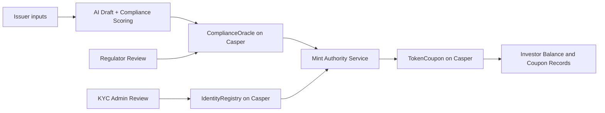

# NexusRWA

**NexusRWA** is an agentic, AI-assisted Real-World Asset (RWA) issuance platform built for the **Casper Agentic Buildathon 2026 - Final Round** (Casper Innovation Track: Agentic AI x DeFi x RWA). It lets an issuer draft an offering, have an AI agent score it against jurisdictional compliance rules, route it through human regulator/KYC review, and then mint, subscribe, and settle a coupon-bearing token whose full lifecycle is recorded on **Casper Testnet**.

The project directly targets the buildathon's "AI-Driven Compliance & KYC" and "RWA Oracle Agent" build directions: an AI agent handles document analysis and compliance scoring off-chain, is designed to anchor verifiable evidence on-chain via a Rust/Odra `ComplianceOracle` contract (Testnet deployment pending), and gates minting/subscription through an on-chain `IdentityRegistry` already live on Casper Testnet, while humans (regulator, KYC admin) retain final authority — combining autonomous AI agency with trust-minimized, auditable on-chain state.

## Why This Project Fits the Final Round

| Judging Criterion | How NexusRWA Delivers |
|---|---|
| **Technical Execution** | Three Rust/Odra smart contracts (`ComplianceOracle`, `IdentityRegistry`, `TokenCoupon`). `IdentityRegistry` and `TokenCoupon` are deployed and tested on Casper Testnet with live deploy hashes recorded in `app/data/deployments.json`; `ComplianceOracle` ships complete Rust/Odra source and passes local unit tests, with Testnet deployment as the next step. Backed by a Next.js/TypeScript app with real API routes, not just static mockups. See [Architecture](#architecture). |
| **Innovation & Originality** | Combines AI-generated compliance scoring, on-chain score anchoring, and identity-gated token minting into a single reproducible pipeline — an agentic compliance officer that a human can audit and override. |
| **Use of AI / Agentic Systems** | An AI agent drafts prospectus content, scores it against `app/compliance-rules/sfc-rules.json`, and produces a report hash that is submitted on-chain; an advisor flow assists investors during subscription. |
| **Real-World Applicability** | Rules model real securities-style compliance concepts (issuer disclosure, investor eligibility, coupon terms) and include asset-class packs for bonds, trade receivables, green bonds, and REITs. |
| **User Experience & Design** | End-to-end UI covering issuer, regulator, KYC admin, and investor journeys (`/prospectus`, `/tokenize`, `/compliance`, `/regulator`, `/kyc`, `/subscribe`, `/portfolio`). |
| **Working Smart Contracts** | Live Casper Testnet deploy hash, contract hash, and explorer link recorded in `app/data/deployments.json` and reproduced in this README. |
| **Long-Term Launch Plans** | See [Roadmap](#roadmap) for the 3-month and 6-12 month plan to harden and expand the product. |
| **Potential for Long-Term Impact** | A reusable agentic-compliance pattern that can be extended to new jurisdictions and asset classes on Casper, growing the ecosystem's RWA tooling. |

## Submission Essentials

Per the official Final Round rules (`document/finalround.md`), every project must ship three things — here is where to find each in this repository:

| Required Item | Where It Is |
|---|---|
| Working prototype on Casper Testnet with a transaction-producing on-chain component | `app/data/deployments.json` and `FINAL_SUBMISSION_ADDRESSES.md` |
| Open-source GitHub repository with README + usage instructions | This repository, plus [Quick Start](#quick-start) and [Reviewer Playbook](#reviewer-playbook-no-marketing-8-12-minutes) |
| Public demo video | See Demo and BUIDL Links |


## Repository Metadata (GitHub)

Set these repository fields in GitHub Settings so reviewers can validate quickly:

- Description: `Agentic RWA issuance MVP on Casper Testnet with compliance and identity-gated token coupon lifecycle.`
- Website: `<BUIDL_OR_PROJECT_URL>`
- Topics (minimum): `casper-blockchain`, `casper-network`, `buildathon`
- Suggested extra topics: `rwa`, `compliance`, `ai-agent`, `odra`, `wasm`, `nextjs`


## GitHub Community Standards

Community profile target path: `https://github.com/skymiss18/casper-agentic-buildathon/community`

Recommended files under `.github/` for full health score:

- `.github/CODE_OF_CONDUCT.md`
- `.github/CONTRIBUTING.md`
- `.github/SECURITY.md`
- `.github/SUPPORT.md`
- Issue templates under `.github/ISSUE_TEMPLATE/`
- Optional: `.github/pull_request_template.md`

Current repository already includes CI workflow:

- `.github/workflows/build-casper-contracts.yml`


## Submission Readiness (DoraHacks)

| Requirement | Status | Evidence |
|---|---|---|
| Working prototype on Casper Testnet with transaction-producing on-chain component | Complete | Deploy record in `app/data/deployments.json` |
| Open-source repository with README and usage instructions | Complete | This repository + setup/run steps below |
| Public demo video | Pending link update | Add final public URL in Demo section |

## Security and CI

### CI Status

- Casper contract build/test workflow: `.github/workflows/build-casper-contracts.yml`
- Builds Rust/Odra contracts and runs `cargo odra test` for key modules.

### Security Configuration Checklist

Enable and verify in GitHub repository settings:

1. Code scanning (CodeQL default setup)
2. Dependabot alerts
3. Dependabot security updates
4. Dependabot version updates (recommended)
5. Secret scanning (if available for your plan)

Submission target:

- Open High/Critical alerts: **0**

Suggested verification command for local dependency hygiene:

```bash
# Node ecosystem
cd app && npm audit --audit-level=high

# Rust ecosystem (install once: cargo install cargo-audit)
cd app/contracts-casper && cargo audit
```

If any High/Critical issue appears, patch and re-run before final submission.


## What This Project Does

NexusRWA is a full workflow for regulated-style token issuance:

1. AI drafts offering content from issuer inputs.
2. AI scores the submission against SFC-oriented rules.
3. Compliance score evidence is designed to be anchored to Casper via `ComplianceOracle` (contract implemented and unit-tested; Testnet deployment pending).
4. Regulator and KYC admin remain human-in-the-loop.
5. Minting/subscription flows are executed by authorized mint authority on Casper via the live `IdentityRegistry` and `TokenCoupon` contracts.
6. Coupon metadata and investor balances are recorded on-chain.

This repository focuses on a working Casper prototype for the buildathon round.

## Architecture



## Agentic + Human-in-the-Loop Model

- AI is used for drafting, document analysis, and scoring assistance.
- Regulator and KYC admin remain explicit decision makers.
- Casper contracts store key issuance and lifecycle state.
- Minting is protected by authorization (`owner` or `mint_authority`) at the contract level.

Note: In this buildathon prototype, some compliance gating is performed by authorized service logic that writes/executes on Casper, rather than all checks being embedded as direct cross-contract calls inside `token-coupon`.

## Application Routes

UI routes under `app/src/app`:

- `/prospectus`
- `/tokenize`
- `/compliance`
- `/audit`
- `/regulator`
- `/kyc`
- `/admin/kyc`
- `/subscribe`
- `/portfolio`

API routes under `app/src/app/api` include:

- `/api/tokenize/*`
- `/api/compliance/*`
- `/api/kyc/*`
- `/api/subscribe/*`
- `/api/portfolio/*`
- `/api/audit/*`
- `/api/advisor/*`

## Technology Stack

- Frontend: Next.js, React, TypeScript, Tailwind CSS
- Casper contracts: Rust + Odra + WASM
- EVM fallback contracts (secondary path): Solidity + Hardhat
- AI layer: OpenAI-compatible provider and rule-based scoring pipeline
- Data artifacts: local JSON registries in `app/data`

## Quick Start

```bash
git clone <repo>
cd casper-agentic-buildathon/app
npm install
npm run dev
```

Open: http://localhost:3000

## Environment

Create `app/.env.local`:

```env
CASPER_CHAIN_NAME=casper-test
CASPER_RPC_URL=https://rpc.testnet.casperlabs.io
CASPER_DEPLOY_TIMEOUT_MS=300000

CASPER_ORACLE_KEY=<ed25519-private-key-hex>
CASPER_ORACLE_PUBLIC_KEY=<ed25519-public-key-hex>
CASPER_TREASURY_PUBLIC_KEY=<ed25519-public-key-hex>

SILICONFLOW_API_KEY=<api-key>
# or
OPENAI_API_KEY=<api-key>

# Sepolia ETH coupon distribution
COUPON_ID=2026-Q3
COUPON_ETH_PER_TOKEN=0.0001
COUPON_PAYMENT_CONFIRMATIONS=1
# Optional: defaults to app/data/cleanverse-coupon-distributions.json
CLEANVERSE_COUPON_STORE_PATH=<absolute-json-store-path>
```

## Build Casper WASM Contracts

```bash
cargo install cargo-odra --locked
cd app/contracts-casper/compliance-oracle && cargo odra build -b casper
cd app/contracts-casper/identity-registry && cargo odra build -b casper
cd app/contracts-casper/token-coupon && cargo odra build -b casper
```

## Deploy to Casper Testnet (PowerShell)

```powershell
.\deploy-casper-contracts.ps1 -AccountKey <ed25519-hex> -PublicKey <pub-hex>
```

Testnet faucet: https://testnet.cspr.live/tools/faucet

## Reproducible Evidence Commands

From repository root:

```powershell
node test-subscribe.mjs
node test-payment-verification.mjs
node test-mint-error.mjs
```

From `app` directory:

```powershell
node test-deploy-server.cjs
```

## Reviewer Playbook (No Marketing, 8-12 Minutes)

This flow is intended for judges to validate functionality quickly.

### Prerequisites

1. Node.js 20+ and npm installed
2. Rust toolchain available for contract build checks
3. Testnet-funded Casper account if redeployment is needed
4. `app/.env.local` configured

### Step-by-Step Validation

1. Install and run app

```bash
cd app
npm install
npm run dev
```

Expected: local UI opens at `http://localhost:3000` with tokenize/compliance/kyc/subscribe routes available.

2. Build Casper contracts

```bash
cd app/contracts-casper/compliance-oracle && cargo odra build -b casper
cd ../identity-registry && cargo odra build -b casper
cd ../token-coupon && cargo odra build -b casper
```

Expected: WASM outputs generated without build errors.

3. Verify deployment evidence

Inspect `app/data/deployments.json` and open listed explorer URL.

Expected: Casper Testnet deploy exists and status is successful.

4. Run scripted behavior checks

```bash
cd <repo-root>
node test-subscribe.mjs
node test-payment-verification.mjs
node test-mint-error.mjs
```

Expected:

- subscribe flow executes and records expected state
- payment verification script passes
- unauthorized mint scenario fails as designed

5. Validate API-backed route coverage

Manually visit and test:

- `/prospectus`
- `/tokenize`
- `/compliance`
- `/regulator`
- `/kyc`
- `/admin/kyc`
- `/subscribe`
- `/portfolio`

Expected: end-to-end workflow is navigable and actions produce corresponding data artifacts/API responses.

### What to Put on DoraHacks/BUIDL Page

1. Core contract package hash + contract hash + deploy hash
2. 3-5 representative Testnet transactions with one-line purpose each
3. Public demo video URL
4. Short reproducible test steps (copy from this section)

## How This Project Meets Buildathon Eligibility

| Eligibility Criterion (from `document/finalround.md`) | This Project |
|---|---|
| Team size unrestricted | Submitted as a single repository, works for solo or team credit |
| Original, newly developed code/content for the buildathon | All code, contracts, and rules in this repository were built for this event |
| Focus on Agentic AI with DeFi and/or RWA on Casper | AI-driven compliance scoring + identity-gated token issuance on Casper Testnet |
| Fair play / anti-plagiarism / Code of Conduct | Followed throughout development; no third-party proprietary code reused |

Official reference dates: Qualification Round opens June 1, 2026; submission deadline July 7, 2026; Final Round runs July 13-26, 2026.

## Roadmap

### Next 3 Months

- Harden Casper deployment reliability and monitoring.
- Add deterministic verification script for AI report hash to reduce trust assumptions.
- Improve judge-facing demo automation for full issuance walkthrough.

### Next 6-12 Months

- Expand jurisdictional rule packs (beyond current SFC-focused set).
- Increase automation for compliance lifecycle events with stricter controls.
- Package the workflow as compliance tooling for institutional issuers.

## Repository Structure

```text
app/
  compliance-rules/
    sfc-rules.json
  contracts-casper/
    compliance-oracle/
    identity-registry/
    token-coupon/
  data/
    deployments.json
    kyc-inbox.json
    sfc-inbox.json
  src/
    app/
    lib/
```


## License

MIT